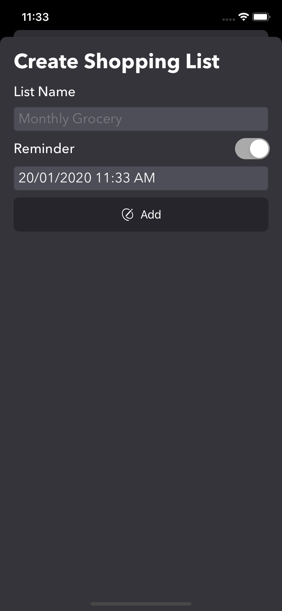
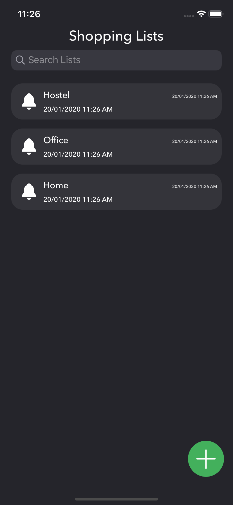
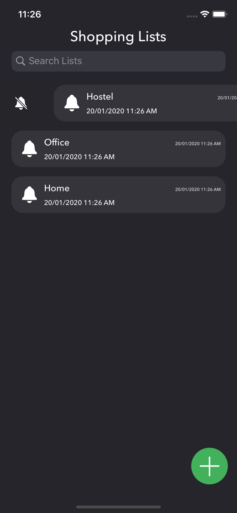
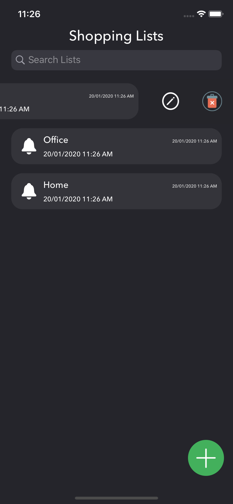
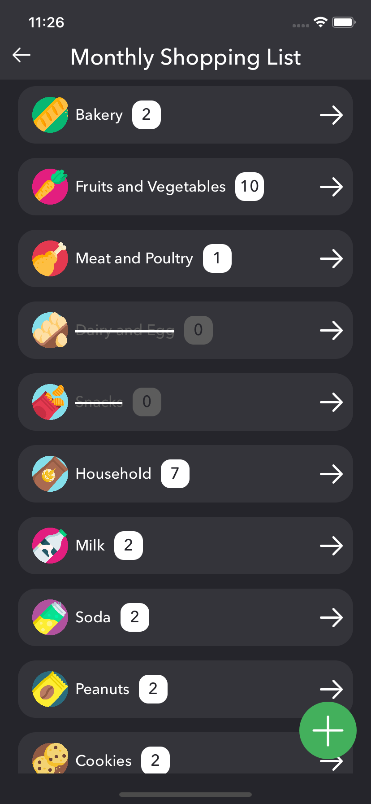
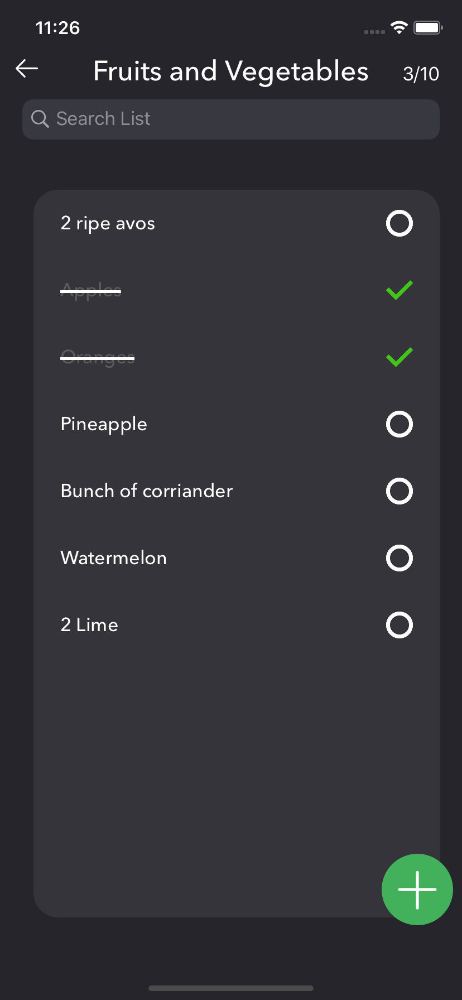

# Groc
> A small grocery list application.

[![Swift Version][swift-image]][swift-url]
[![Build Status][travis-image]][travis-url]
[![License][license-image]][license-url]

Groc is a grocery application I decided to create  to remove some rust from my development skills after I had started doing my MS in Software Engineering. It is currently CoreData based, and Firebase support will be added later.

#### Screenshots
<table>
  <tr>
    <td></td>
    <td></td>
    <td></td>
    <td></td>
    <td></td>
    <td></td>
  </tr>
 </table>

## Features

- [x] Create List
- [x] Create Category
- [x] Add Item
- [x] Mark as completed

## TODO
- [ ] Fix some bugs when marking items as complete.
- [ ] Add firebase support.
- [ ] Improve UI/UX.
- [ ] Add missing/more icons.
- [ ] Store entered categories/items names and show them as suggestions.
- [ ] Add freestyle unit text field for custom units.
- [ ] Add generics wherever possible. (code)

## Requirements

- iOS 13.0
- Xcode 11.3

## Contribute

I would love you for the contribution to Groc.

## Meta

Takasur Azeem – (Twitter) [@takasurazeem](https://twitter.com/takasurazeem) – takasurazeem@gmail.com
(Telegram) [@takasur](https://t.me/takasur)

Distributed under the MIT license.

[https://github.com/yourname/github-link](https://github.com/takasurazeem/)

[swift-image]:swift-5.0-orange.svg
[swift-url]: https://swift.org/
[license-image]: https://img.shields.io/badge/License-MIT-blue.svg
[license-url]: LICENSE
[travis-image]: https://img.shields.io/travis/dbader/node-datadog-metrics/master.svg?style=flat-square
[travis-url]: https://travis-ci.org/dbader/node-datadog-metrics
[codebeat-image]: https://codebeat.co/badges/c19b47ea-2f9d-45df-8458-b2d952fe9dad
[codebeat-url]: https://codebeat.co/projects/github-com-vsouza-awesomeios-com
